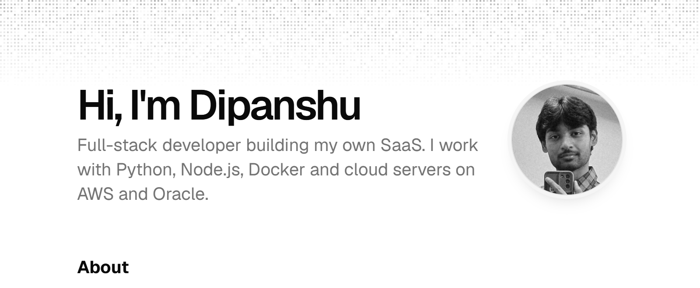

<h1 align="center">Hi, I'm Dipanshu</h1>

<p align="center">
  Full-stack developer from India, building my own SaaS under the name DevPilotX.
</p>

<p align="center">
  <a href="https://devpilotx.github.io/devpilotX/">Website</a>
  &nbsp;·&nbsp;
  <a href="https://www.linkedin.com/in/dipanshu03j">LinkedIn</a>
  &nbsp;·&nbsp;
  <a href="https://x.com/devpilotx">X</a>
  &nbsp;·&nbsp;
  <a href="https://www.instagram.com/devpilotx">Instagram</a>
  &nbsp;·&nbsp;
  <a href="mailto:connect.dipanshukumar@gmail.com">Email</a>
</p>

## About me

I finished my BCA at Maharishi Markandeshwar (Deemed to be University), Mullana, in 2024. Before that I studied at Jawahar Navodaya Vidyalaya in Darbhanga, Bihar.

These days I build products end to end. I write the frontend and the API, design the database, and run everything myself with Docker on AWS EC2 and Oracle Cloud machines. Most of my work is in Python and TypeScript.

## Featured projects

| Project | What it is | Built with |
| --- | --- | --- |
| [**Quant**](https://github.com/devpilotX/quant) | Systematic trading system for NSE and BSE with a decision engine, an event-driven backtester and a live dashboard. Runs in paper mode. | Python, FastAPI, Next.js, PostgreSQL, Redis |
| [**Maanak**](https://github.com/devpilotX/maanak) | Inspection recording for packaged goods under India's Legal Metrology rules. OCR reads the label, a rule engine checks it, and every decision is kept in a tamper-evident audit trail. | Python, FastAPI, PostgreSQL, Tesseract, Docker |
| [**PaisaReality**](https://github.com/devpilotX/paisarealitymoney) | Personal finance site for India with daily gold, fuel and LPG prices for 50+ cities, 350+ government schemes and a set of money calculators. | Next.js, TypeScript, PostgreSQL, Razorpay |
| [**Veydria**](https://github.com/devpilotX/Veydria) | AI governance platform that maps AI systems to the EU AI Act, NIST AI RMF and ISO 42001, runs evals and prepares audit documents. | Next.js, TypeScript, Drizzle, FastAPI, Stripe |

More of what I've built, from a Rust SQL engine to a Lean 4 proof, is on [my website](https://devpilotx.github.io/devpilotX/#builds) and in my [repositories](https://github.com/devpilotX?tab=repositories).

## Tools I use

<p>
  
</p>

## My website

My portfolio has the full list of projects, my education and a small blog. You can find it at [devpilotx.github.io/devpilotX](https://devpilotx.github.io/devpilotX/).

<p align="center">
  <a href="https://devpilotx.github.io/devpilotX/">
    <picture>
      <source media="(prefers-color-scheme: dark)" srcset=".github/assets/site-dark.png">
      
    </picture>
  </a>
</p>

## Get in touch

The best way to reach me is email at [connect.dipanshukumar@gmail.com](mailto:connect.dipanshukumar@gmail.com). I'm also on [LinkedIn](https://www.linkedin.com/in/dipanshu03j) and [X](https://x.com/devpilotx).

<br>

<details>
<summary><b>About this repository</b></summary>

<br>

[](https://github.com/devpilotX/devpilotX/actions/workflows/deploy.yml)

This repo holds the source for my website. It is built with Next.js 16, Tailwind CSS v4, shadcn/ui, Magic UI and Motion, with the blog written in MDX through Content Collections. The site is exported as static files and hosted on GitHub Pages.

To run it locally you need Node.js 20.9 or newer and pnpm:

```bash
git clone https://github.com/devpilotX/devpilotX.git
cd devpilotX
pnpm install
pnpm dev
```

| Command          | What it does                                  |
| ---------------- | --------------------------------------------- |
| `pnpm dev`       | Starts the dev server on port 3000            |
| `pnpm build`     | Builds the static site into `out/`            |
| `pnpm start`     | Serves the built `out/` folder on port 4173   |
| `pnpm lint`      | Runs ESLint                                   |
| `pnpm typecheck` | Runs the TypeScript compiler (after a build)  |

Profile details, projects and links live in [`src/data/resume.tsx`](./src/data/resume.tsx), and blog posts are MDX files in [`content/`](./content).

Every push to `main` runs [`deploy.yml`](./.github/workflows/deploy.yml), which lints, builds and type checks the site before publishing it. Pull requests run the same checks without deploying. The build reads its base path from the Pages settings, so moving to a custom domain only needs a change under **Settings → Pages**.

The design is based on the open source [portfolio template by Dillion Verma](https://github.com/magicuidesign/portfolio). Both are released under the [MIT license](./LICENSE).

</details>
